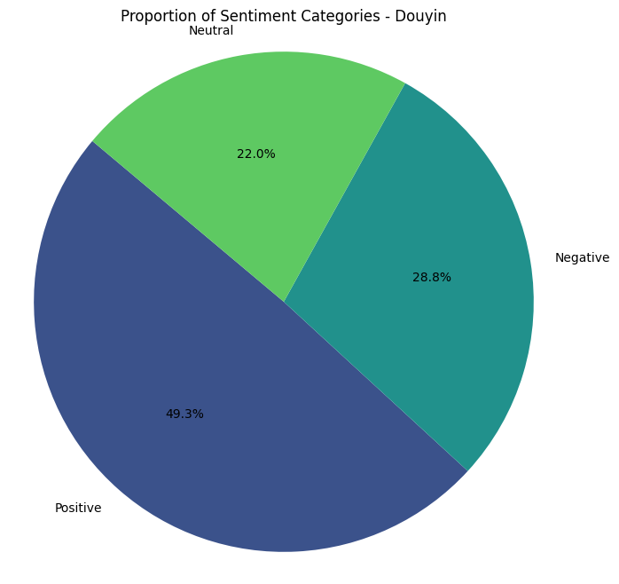
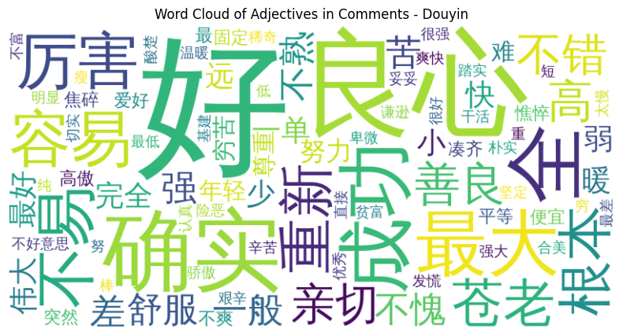
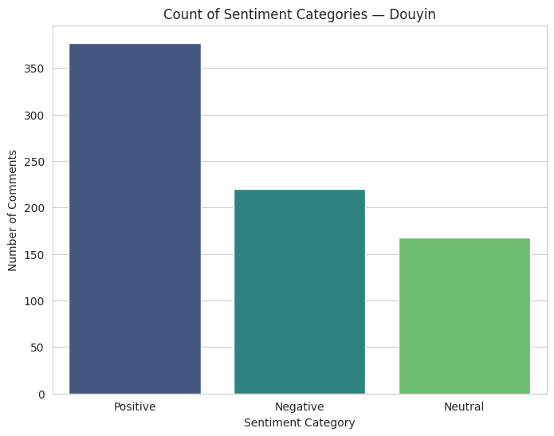
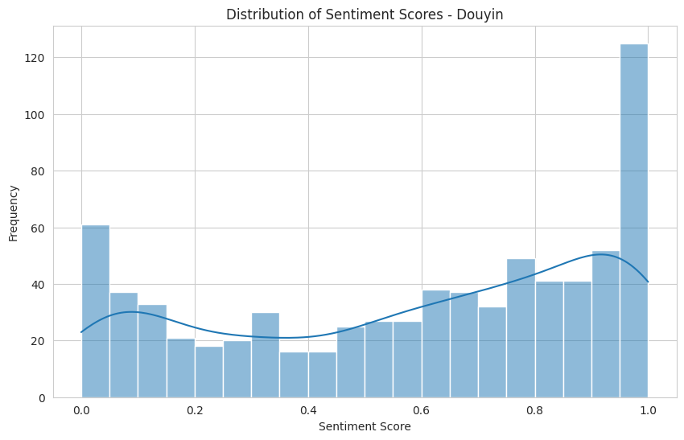

# Social Sentiment Analysis: Cross-Platform Study of Richard Liu's Delivery Event

A data-driven investigation into public perception and platform-specific discourse surrounding JD.com founder Richard Liu's (Liu Qiangdong) frontline delivery campaign.

## 📌 Project Overview
In the era of information fragmentation, identifying authentic public sentiment while filtering emotional noise is a core challenge. This project analyzes the "Richard Liu Delivery" viral event by tracking emotional evolution across two distinct social media ecosystems: **Douyin** and **Xiaohongshu**.

The goal is to extract key social narratives and demonstrate cross-platform public opinion assessment capabilities using automated data pipelines.

## 🛠️ Tech Stack
* **Data Sourcing:** Web Scraper (Custom extraction from Douyin & Xiaohongshu)
* **Data Processing:** Python, Pandas, Regex (`re`)
* **AI/NLP Model:** Hugging Face `distilbert-base-multilingual-cased`
* **Visualization:** Matplotlib, Seaborn
* **Environment:** Google Colab

## 🧪 Methodology
The project implements an automated "Data Cleaning + AI Inference" workflow:
1.  **Collection:** Scraped raw user comments from Douyin and Xiaohongshu.
2.  **Preprocessing:** Cleaned text data by removing null values, special characters, and non-text noise using `pandas` and `re`.
3.  **Sentiment Inference:** Deployed a lightweight multilingual NLP model to classify comments into **Positive**, **Neutral**, and **Negative** categories.
4.  **Analytics:** Performed frequency analysis and sentiment distribution mapping.

## 📈 Key Insights & Results

### 1. Douyin Sentiment Profile
The Douyin audience presented a highly critical perspective, often viewing the event through a socio-economic lens.

* **Analysis:** Negative sentiment reached **50.0%**. Users frequently discussed "Corporate Showmanship" and expressed skepticism regarding the gap between billionaires and frontline workers.

### 2. Douyin High-frequency Keywords & Trends

---

### 3. Xiaohongshu Sentiment Profile
In contrast, the Xiaohongshu community acted more as "onlookers," maintaining a largely neutral or curiosity-driven stance.

* **Analysis:** Neutral sentiment dominated at **61.9%**. Discussions were more relaxed, focusing on aesthetic details and the novelty of the experience.

### 4. Xiaohongshu High-frequency Keywords & Trends

## 📂 Repository Structure
* `刘强东送外卖舆情分析_抖音.ipynb`: Analysis notebook for Douyin data.
* `刘强东送外卖舆情分析_小红书.ipynb`: Analysis notebook for Xiaohongshu data.
* `images/`: Directory containing the visualization plots used in this README.

## ⚖️ Reflection & Ethics
* **Technical Limits:** While AI scales efficiency, nuances like Chinese sarcasm ("Sarcastic Memes") remain a challenge for NLP models.
* **Synergy:** The project demonstrates that true insight comes from the intersection of **Multi-platform Data + AI Assistance + Human Qualitative Analysis**.

---
**Author:** Yixin Wang
